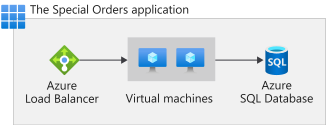

## connectivity troubleshooting
There are two major causes if you cannot reach a host:
* If you have a firewall in the way, you hit the TCP timeout. The TCP timeout is 21 seconds in this case. Use the ```tcpping``` tool to test connectivity.
* DNS isn't accessible. The DNS timeout is 3 seconds per DNS server. If you have two DNS servers, the timeout is 6 seconds. Use ```nameresolver``` to see if DNS is working. 
You can't use nslookup, because that doesn't use the DNS your virtual network is configured with. If inaccessible, you could have a firewall or NSG blocking access to DNS or it could be down.


## Cosmos DB
RU = Request unit. Its a measure based on CPU, IOPS and Ram needed to perform DB requests.
1 RU = Resources needed to read 1KB Element by ID and partitionkey. 

### Partitionkey
Cosmos distributes partitions on its physic partitions. The key to group the data is set by the user in form of a partitionkey.
The partitionkey should devide the data into equal pieces. Unique ElementIds are good choice for partitionkey.

## Azure VMs
Usecases:
* Is good for developing and testing.
* Run application in cloud
* extend your datacenter

It is cool because you can shutdown your VM and don't pay anymore. When you manage VM's yourself you still pay for the underlying infrastructure.

### VM scaling group
You can define a group of VMs which share all the same settings.

### Availabilitygroup
You can group your VMs into groups and Azure will make sure that VMs in the groups
are distributed over different failuredomains.

#### Failure-Domain
Group depending on same infrastructure as electricity, switch, rack etc.

#### Update-Domain
Group of Hardware/Software which can be updated at the same time

## Load balancer
To make sure, traffic only goes to VMs which are running, you need to place an Azure Load Balancer in front of them.


# Azure infrastructure 

## Regions
Stands for an area on the planet which contains at least on azure datacenter. 
### Region pairs
If you want to go full resilience you make usage of region pairs. If a whole region goes down, your resource would fail over to the region pair.

### Sovereign Regions
These are some seperated azure regions for US and China goverment. 

## Availability zones
Availability-zone is one of minimum three physically separate datacenter in an azure region (Not every azure region support availability zones)
There might be even more than 3 zones within a region. 

If you spread your VM's into 3 availability zones, Azure makes sure that these VMs are in 3 different Update and failure domains.
To make sure that they, for example, don't get updated at the same time.

## API Gateway
Azure API Gateway can mock api and can do retry logic.
Its good practice to use a subscription key for your api. You can define access policies for each subscription key.
API Gateway also supports a variety of policies to apply on the incoming traffic. 

## Event grid
Webhooks can be used to get synchronous notification from the event grid.

## Bastion
Lets you dp rdp to your VMs. 

## azure resource groups
* Azure management groups: Lets you group subscriptions (Composition of multiple management groups are possible). Enables to define access for multiple subscriptions and to apply policies to multiple subscriptions. 
* Subscriptions: Second tier. Where the billing happens. You can also define access on this level. You cannot put a subscription into another subscription.
* Resource Group: To group resources
* Resource

Resource group stores metadata about itself and its resources. So with the region of the resourcegroup we decide where to store this data.
Resource groups cannot be nested


# Azure groups
secrity group: Used to organize members and access.
microsoft 365 groups: Used to colaborate. The allow access on mail boxes, calendar and sharepoint sites etc.

# RBAC and AD

Every Azure-Abonnement is associated with one Azure AD-directory.
Azure AD connect is used to sync Azure AD and on-prem AD.

RBAC Permission need a principal (user, group or service principal) a role def (dos and donts ) and a scope (management group, subscription resource group or resource)


# Azure AD
The term Tenant means a single instance of Azure AD representing a single organization.
The terms Tenant and Directory are often used interchangeably.

## Locks
Locks get inherited by resources

Two types of locks: Readonly-lock, Delete-lock

## Azure functions
If you have code which only needs to be run after a certain trigger like REST call, timer or event. (If you need to have the code running all the time, then better use web-app or VW as underlying platform)

### Durable function
is azure function but stateful 

## Azure AD
A tenant is a representation of an organization. A tenant is typically separated from other tenants and has its own identity.
Each Microsoft 365, Office 365, Azure, and Dynamics CRM Online tenant is automatically an Azure AD tenant.

## Azure policy
The policy definition can be assigned to Management groups, subscriptions or resource groups.

## Calculate composite SLA


| Service | SLA |
|---------|-----|
| Azure Virtual Machines | 99.9 percent |
| Azure SQL Database | 99.99 percent |
| Azure Load Balancer | 99.99 percent |

As two VMs are required, you need to use the SLA of a VM twice.
99.9%×99.9%×99.99%×99.99% (=0.999×0.999×0.9999×0.9999) 
=0.9978 (=99.78%)

