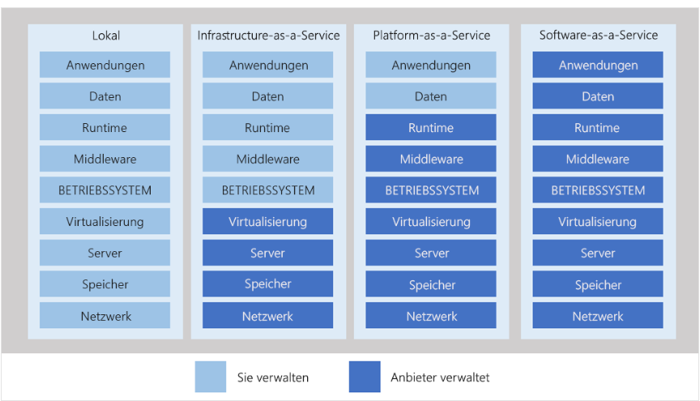

### cloud

## public cloud
Is hosted by a cloudprovider like azure and you will normally share resources with others.

## private cloud
You host a cloud yourself. You provide the hardware and run it as a cloud.
This scenario should be used if your environment needs special restrictions (sensitive data)

## hybrid cloud
You use both, private and public cloud together.

## multi cloud
You use different cloud providers.

## cloud services

### Iaas (Infrastructure as a Service)
You will have a lot control over the hardware. You basically rent hardware. Operating system, software, middleware is your problem.

### Platform as a Service
You don't need to care about the underlying hardware. Can be used as development environment. 

### Software as a Service
Hosted software. Office 365, Skype and Dynamics CRM online sind SaaS-Software.
The cloud provider is in charge of the application.

## Virtual machines for development
You can automatically shutdown your virtual machine to save money.