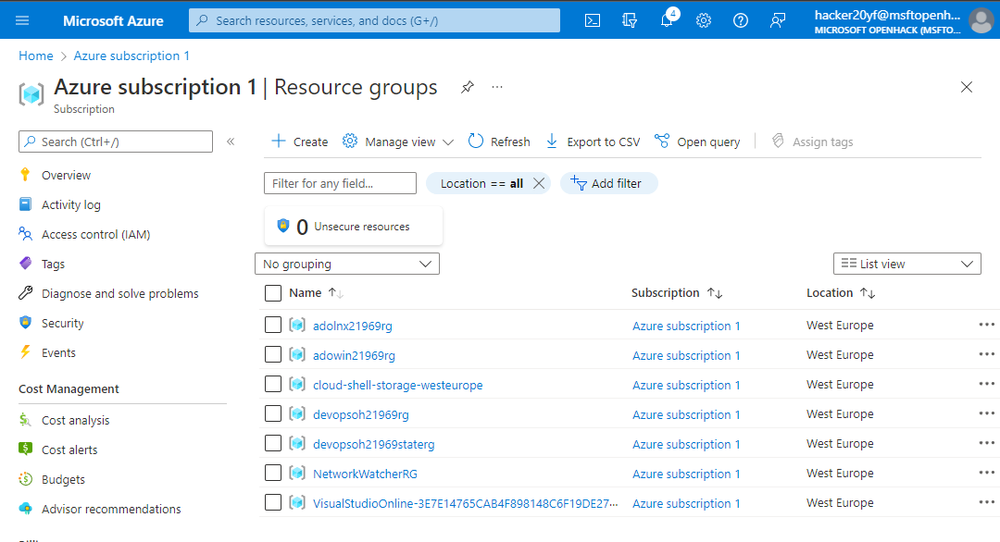
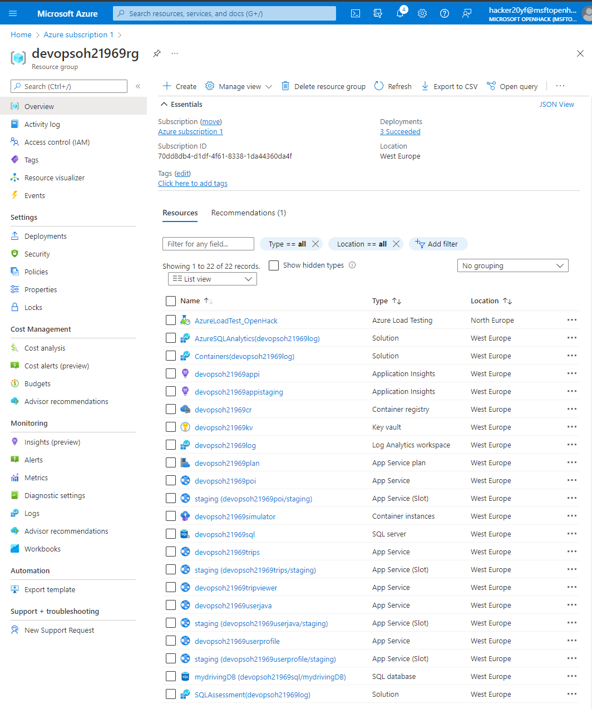
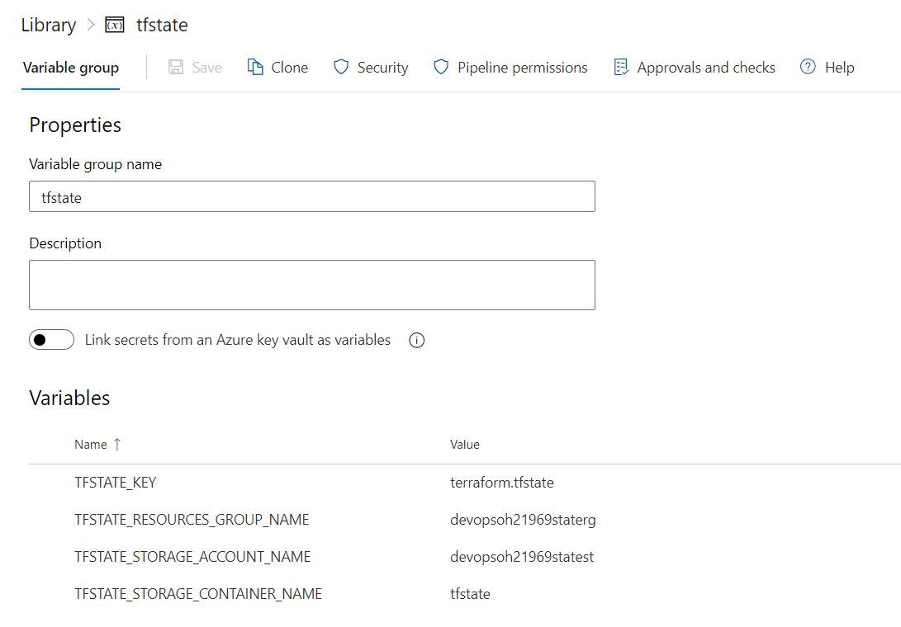
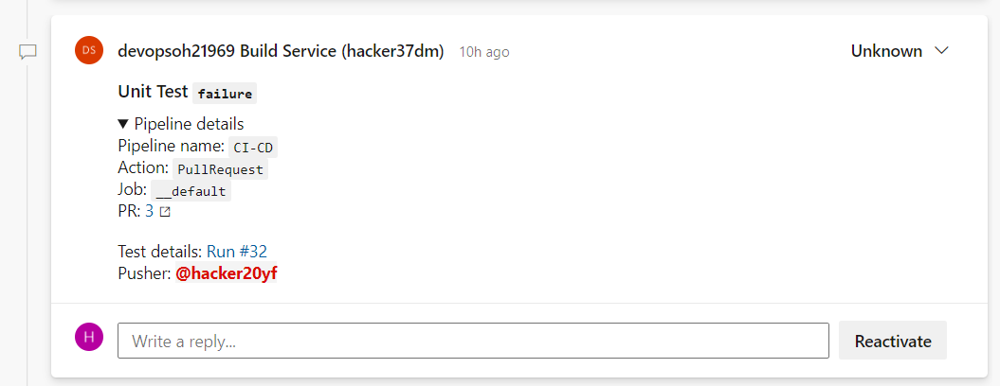
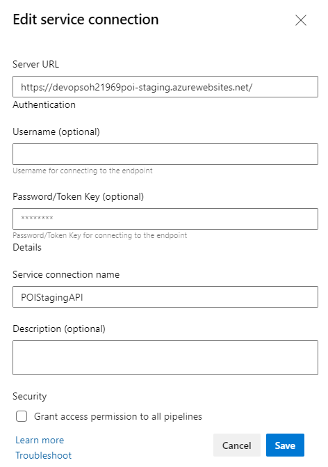

## OpenHack Documentation

The setup is 4 different API applications and one website application to

* Tripviewer (.NET Core): The team website your customers use to review their driving scores and trips is being simulated against the APIs.
* Trips (Go): The trips API is where the mobile application sends the trip data from the OBD device to be stored.
* POI: (.NET Core) The POI (Points Of Interest) API is collecting the points of the trip when a hard stop or hard acceleration has detected.
* User (Node): The user profile API is used by the application to read the user’s information.
* UserJava (Java): The user-java API is used by the application to create and modify the users.

A simulator runs throughout the entire event after you spin up infrastructure to send your APIs the data your users generate in real life.


We got provided with 6 users on Azure which had owner role on a subscription for this OpenHack.

### Challenge 0 - Bring Your Own Subscription (BYOS)
First decision we had to make is: Are we going to use ADO or GitHub? We opted for ADO, as we all using this on daily basis.
We should find deployment scripts under: https://aka.ms/OpenHackBYOS under devops folder.
With no further infos we had to figure out what to do... Going from on README.md to another and then follow this step by step
manual: https://github.com/microsoft/OpenHack/blob/main/byos/devops/ADO.md#deployments-steps

Its basically open shell.azure.com, checking out the BYOS repo and running a file (deploy-ado.sh) to create the whole setup (Azure and ADO)
I think we already did our first mistake to not store the "azuresp.json" which included the credentials of our service principal.

We ended up with a new ADO space with a repo copied from: https://github.com/Microsoft-OpenHack/devops-artifacts

On Azure it looked like this:




### Challenge 1 - Establish your plan
We had to configure our newly created ADO. Like setting ADO into Agile mode and creating our first task board with specific rules and states.
To distinguish different teams on the same board we used swimlanes.

### Challenge 2 - Setting up the Development Workflow
We had to set up some branch policies. Like not allowing changes without PRs and every PR needs to have at least x reviewer.
It was nice to see how easy it is to set rules on specific folders in the repository. I remember that was an almost impossible
task with Bitbucket in 2020.

### Challenge 3 - Deploy Cloud Infrastructure with Infrastructure as Code (IaC)
The whole infrastructure is defined as code (IaC) and there are terraform and biceps scripts to do the same. We opted to
use Terraform. There was a bashscript which we needed to redo as a pipeline. So created our first ADO pipeline and explored
the built-in tasks they provide.

Terraform needs to have access to its Terraform state. For this we got a Variable Group which had all the infos to
connect to our Terraform state on Azure.



First Task in the pipeline is to check the terraform (*.tf) files:

```
- task: TerraformCLI@0
  inputs:
    command: 'fmt'
    workingDirectory: 'iac/terraform'
    allowTelemetryCollection: true
    displayName: 'Check Syntax'
```

Now we want to init terraform. This was a tricky one, because our pipeline has two stages (validate & Deploy) and this
Task needed to be run on each Stage.

```
- task: TerraformCLI@0
  inputs:
    command: 'init'
    workingDirectory: 'iac/terraform'
    backendType: 'azurerm'
    backendServiceArm: 'Azure subscription 1(70dd8db4-d1df-4f61-8338-1da44360da4f)'
    backendAzureRmSubscriptionId: '$(SUBSCRIPTION_ID)'
    backendAzureRmResourceGroupName: '$(TFSTATE_RESOURCES_GROUP_NAME)'
    backendAzureRmStorageAccountName: '$(TFSTATE_STORAGE_ACCOUNT_NAME)'
    backendAzureRmContainerName: '$(TFSTATE_STORAGE_CONTAINER_NAME)'
    backendAzureRmKey: '$(TFSTATE_KEY)'
    allowTelemetryCollection: true
  displayName: 'Terraform Init'
```

After Terraform got initialized, we could run the task we actually wanted to run:

```
- task: TerraformCLI@0
inputs:
  command: 'validate'
  workingDirectory: 'iac/terraform'
  allowTelemetryCollection: true
displayName: 'Terraform Validate'
```

After the validation stage we run the "plan" & "apply" terraform commands.

```
- task: TerraformCLI@0
  inputs:
    command: 'plan'
    workingDirectory: 'iac/terraform'
    environmentServiceName: 'AzureServiceConnection'
    runAzLogin: true
    providerAzureRmSubscriptionId: '$(SUBSCRIPTION_ID)'
    commandOptions: '-var "location=$(LOCATION)" -var "resources_prefix=$(RESOURCES_PREFIX)"'
    allowTelemetryCollection: true
    displayName: 'Terraform Plan'

- task: TerraformCLI@0
 inputs:
   command: 'apply'
   workingDirectory: 'iac/terraform'
   environmentServiceName: 'AzureServiceConnection'
   runAzLogin: true
   providerAzureRmSubscriptionId: '$(SUBSCRIPTION_ID)'
   commandOptions: '-var="location=$(LOCATION)" -var="resources_prefix=$(RESOURCES_PREFIX)"'
   allowTelemetryCollection: true
 displayName: 'Terraform Apply'
```

#### Conditions in the pipeline
The steps would only run if it is a PullRequest to the main branch.
```
condition: and(eq(variables['Build.SourceBranch'], 'refs/heads/main'), eq(variables['Build.Reason'], 'PullRequest'))
```

#### tree command at start
It is a good idea to just run the tree command, so we can check on the run output where we actually are.


### Challenge 4 - Implement Continuous Integration (CI) with Testing
We built a CI pipeline. We opted to do it for a .net core application. To do so we needed to run:

* dotnet restore
* dotnet build
* dotnet test

in ADO Pipeline yaml this looks like this:
Especially the --filter on test command will come handy. Took us a while to figure out how to point to the right .sln file.
In the documentation on the internet they always talk about providing a .csproj file, but you can also point to a .sln file
in the same attribute.

```
- task: DotNetCoreCLI@2
  inputs:
  command: 'restore'
  projects: 'apis/poi/*.sln'
  displayName: 'dotnet restore'

- task: DotNetCoreCLI@2
  inputs:
  command: 'build'
  projects: 'apis/poi/*.sln'
  arguments: '--configuration $(buildConfiguration)'
  displayName: 'dotnet build $(buildConfiguration)'

- task: DotNetCoreCLI@2
  inputs:
  command: 'test'
  projects: 'apis/poi/*.sln'
  arguments: '--filter "FullyQualifiedName~UnitTest" --logger "trx;LogFileName=UnitTestResults.trx" --results-directory ./TestResults'
  displayName: 'dotnet test'
```

Then we used two builtIn Tasks to comment on a PR and to create a bug.

We got a good template for a PR comment if Unitests failed:



```
### Unit Test `failure`
<details>
<summary>Pipeline details</summary>

Pipeline name: `$(Build.DefinitionName)`
Action: `$(Build.Reason)`
Job: `$(System.JobName)`
PR: [$(System.PullRequest.PullRequestId)]($(System.PullRequest.SourceRepositoryURI)/pullrequest/$(System.PullRequest.PullRequestId))
</details>

Test details: [Run #$(Build.BuildId)]($(System.CollectionUri)$(System.TeamProject)/_build/results?buildId=$(Build.BuildId)&view=ms.vss-test-web.build-test-results-tab)
Pusher: @<$(Build.RequestedForId)>
```
Both tasks are using conditions like:
```
condition: and(failed(), eq(variables['Build.Reason'], 'PullRequest'))
condition: and(failed(), eq(variables['Build.Reason'], 'Manual'))
```


### Challenge 5 - Implement Continuous Deployment (CD)
Needed to create a new pipeline to deploy a docker image to Azure container registry.
We basically just copy pasted the provided command into the pipeline and it just worked.

To not override the previous docker image, we needed to tag the image with ```$(build.buildId)```
Took us a while to figure out that the azureSubscription parameter for the AzureWebAppContainer Task is the AzureServiceConnection name.

### Challenge 6 - Implement a Blue/Green deployment strategy
Goal is to do some healtchecks (REST calls against /healthcheck endpoint) against the staging slot and if successful, swap staging with production slot.

#### Call a REST API
Todo so we used the "Invoke REST API" Azure pipeline task. In this task you either select "Azure Resource Manager" or "Generic".
In our case we had to call a generic API and to do so, you need to first create a Generic connection under /Project Settings/Service Connections -> New Generic Connection
It is better to just define the serverUrl more general, then every endpoint as new connection. In the task we could then define the UrlSuffix of the specific endpoint.



This task needed to run "agentless", we achieved this by put the task into a job and define the job running in ```pool: server```

#### Swap

The swap is achieved by using the "Azure App service Manage" task and configure it to do a swap action. Important is that the task (in our case the Job)
depends on the previous healtcheck, so it only swaps when previous tasks where successful:.


```
  - job: InvokeRestAPI
    displayName: Invoke REST API
    dependsOn: Deploy
    pool: server
    steps:
      - task: InvokeRESTAPI@1
        inputs:
          connectionType: 'connectedServiceName'
          serviceConnection: 'POIStagingAPI'
          method: 'GET'
          headers: 
          urlSuffix: '/api/healthcheck/poi'
          waitForCompletion: 'false'
          successCriteria: 'eq(root[''status''], ''Healthy'')'
  - job: HotSwap
    displayName: HotSwap
    dependsOn: InvokeRestAPI
    steps:
      - task: AzureAppServiceManage@0
        inputs:
          azureSubscription: 'AzureServiceConnection'
          Action: 'Swap Slots'
          WebAppName: 'devopsoh21969poi'
          ResourceGroupName: 'devopsoh21969rg'
          SourceSlot: 'staging'
```

### Challenge 7 - DevSecOps basics – get rid of secrets
We added a GitLeaks task into our CI Pipeline. GitLeaks searches through the git log and tries to find passwords by matching a lot of different regex.
The rules are configured in a .gitleaks.toml file (template: https://github.com/zricethezav/gitleaks/edit/master/config/gitleaks.toml)

We downloaded the file, pushed it to our repo and adjusted it to rule out the false positives. (You can add some stopwords),
but we weren't successful on this, but using the original template on Github sorted the most false positives out anyway.

```
- job: GitLeaks
  pool:
  vmImage: 'ubuntu-latest'
  dependsOn: []
  steps:
    - task: Gitleaks@2
      inputs:
      scanlocation: '$(Build.SourcesDirectory)'
      configtype: 'custom'
      configfile: '$(Build.SourcesDirectory)/gitleaks.toml'
      redact: false
      reportformat: 'sarif'
```

Next step was to remove the secrets from git. The secrets itself should be stored in an Azure KeyVault (As secrets, not as keys or certificates).
The azure web app should read the secret value from an environment variable. In our case the application setting has a value of:
```
@Microsoft.KeyVault(VaultName=devopsoh21969kv;SecretName=SECRETAPPVERSION)
```
The application would recognize this and try to get the value from the specified vault. To enable the app to do so, we needed to create a system identity:


And on the other hand the KeyVault needs to have an access-policy which allows this identity to ```List``` and ```Get``` on this vault.


### Challenge 9 - Implement a Load Testing & Monitoring solution with alerting
We barely touched this challenge. We created an Azure Load Testing resource on Azure. We could upload this [JMeter file](https://github.com/Microsoft-OpenHack/devops-artifacts/blob/main/support/resources/MyDrivingTest.jmx)
and run the test (Had to configure 4 parameters, which were the url of each API application)


## Key take a ways
A pipeline can be separated into stages. The first stage will check out the repository.
Normally a second stage works with the outcome of the first stage. If you need to have access to the repo on the second
stage you need to check it out again (See stage "Terraform_Deploy" on [IaC Pipeline](IaC.yml))

If you want to insert an approval you can define an environment in the jobs section. The environment can define what and who
needs to be approved.

## Resulted pipelines of our team
- [IaC Pipeline](/software-engineering/devops/IaC.yml)
- [CI Pipeline](/software-engineering/devops/CI.yml)
- [CD Pipeline](/software-engineering/devops/CD.yml)