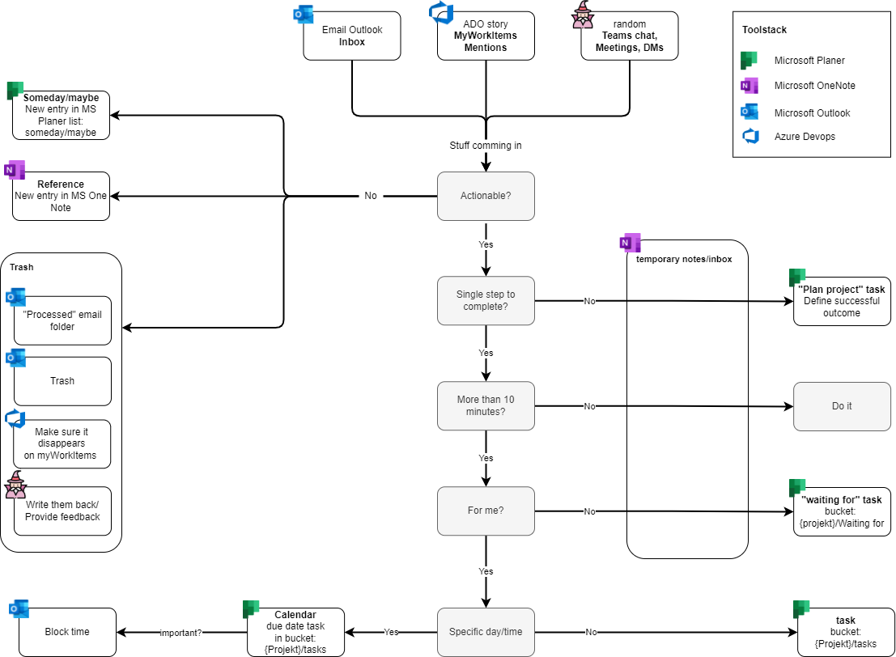

# Time 
## Calendar
If you want to create a meeting for only reminding purpose (like: UAT not available during this time period), 
or to show you are on vacation, you should configure the meeting as "free-time", so it doesn't block the time for your friend for actual meetings.

## 12 hours clock am/pm
Its not always clear how to represent the start and end of a day with 12hours format. To prevent confusion NIST defined it like this:
Start of the day: 12:01 am
End of the day: 11:59 pm

| 12-hour                                                      | 24-hour |
|--------------------------------------------------------------|--------| 
| Midnight (start of day)   12 midnight   12:00 a.m. | 	00:00 |
| 12:01 a.m.                                                   | 	00:01 |
| 01:00 a.m.                                                   | 	01:00 |
| 11:00 a.m.                                                   | 	11:00 |
| 11:59 a.m.                                                   | 	11:59 |
| Noon   12 noon   12:00 p.m.	                       | 12:00  |
| 12:01 p.m.                                                   | 	12:01 |
| 01:00 p.m.                                                   | 	13:00 |
| 11:00 p.m.                                                   | 	23:00 |
| 11:59 p.m.                                                   | 	23:59 |
| Midnight (end of day)   or shown as start of next day   | 24:00 |

# Acronyms
LOB (Line of business)
AOB (Any other business) is used for a last point in agendas to emphasize every other topic can be discussed as well.
PPMO (Project Portfolio management office)

# Effects and laws to describe a standard situation

## Conway's law
This law says an enterprise architecture (how we slice our components) converges with the internal structure of the company's staff
  
## Dunning-kruger effect
This effect says people with low abilities overestimate their abilities and people with high abilities underestimate their abilities. 

# Leading
## Blaming
When there is someone exposed like a project-leader it is easy to blame him/her and talk bad about their way of leading. 
People think they can lead the team much better than the current leader.  
In a lot of cases we also assume the leader has hidden agendas, is lying about stuff, or at least doesn't tell the whole truth. 

In all cases where the leadership actually changed, I took the chance to talk privately with them and could speak 
very openly about the past times. To my surprise it always turns out that they just were humans, did their job and tried their best
to hold multiple groups/stakeholders (with different ambitions) together. 

## Identification of a team
As a team leader you can give your team an identity. This helps everyone to express in the name of a group and to feel they are in the same boat.
* Team name(s)
* A good example is the zkp team: They chose lego as their theme and now everybody is like a lego figure. 
(After the attempt, naming the team to cinema super heros)
* 

# Documentation
P.A.R.A. stands for Projects.Areas.Resources.Archives, the four top-level categories that encompass every type of information you might encounter in your work and life.

# Cruft and technical debts
This is a presentation to explain the business how important built-in quality is. It copied from: [Source](https://martinfowler.com/articles/is-quality-worth-cost.html)

## Is quality worth the cost?

### internal versus external quality
Explain that you talk about internal quality. Its most of the time not visible on the frontend. Its the developer who needs to cope with all this. 

Internal quality
* Module structure
* Software architecture (MVVN)
* Software design (SOLID, yagni etc.)
* Tests

External quality
* What the customer currently sees and feels

### Cruft
(In german überflüssiger Müll / nutzloser Code)

# Getting things done
