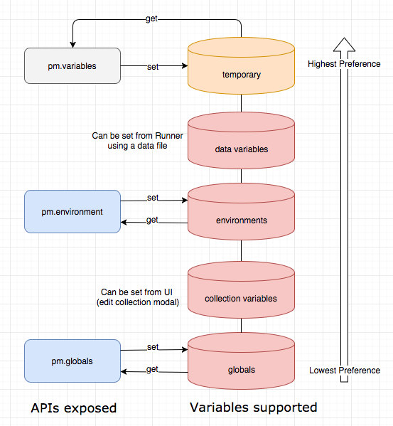

# Postman

## Collections
The Highest logical container for grouping stuff. You can share/import/export a collection.

## Request
You can make a copy of a request with ctrl+c and paste it everywhere with ctrl+v. 

## Workspace
You can have multiple local workspaces and join shared workspaces. Freeplan includes collaboration up to 3 people.

### Moving parts from your personal work to another workspace
You can only move collections from personal to a shared one. (But be careful: Viceversa doesn't work, you will need to export and import it, if you want to do this)

## Environments
You can create environments and chose one for a test-run, regardless on which level you are (request, folder or collection) 
I would create a environment for each server. 

## Variables
Variables can have 5 different scopes. The lower defined variable will override the more global defined ones.

* Global (pm.globals or via ui)
* Collection (pm.collectionVariables or via ui)
* Environment (pm.environment or via ui)
* Data (via ui on runner using data file)
* Local (pm.variables)



## initial and current state
Every variable in Postman can have an initial value. The current value will always override the initial value. 
The initial value will be shared within your team, the current won't be shared.

## Authentication
It is not feasible to define auth header on every request. Thats why you can inherit auth headers from upper folders and finally from the collection. 

### Reading variables from request view
{{username}}

## Writing tests
You can write tests in javascript.

Predefined stuff:

variable "responseBody" represents the responseBody as vanilla object
public class "pm" holds all postman methods. 
  

* Pre-request Script will run before Postman sends the request
* Test will run after Postman received a response

examples:
```
pm.test("test-name", function () { 
    pm.response.to.not.have.jsonBody("error"); 
});

pm.test("test-name", function(){
    pm.expect(pm.environment.get("env")).to.equal("production");
})

pm.test("test-name", function(){
    pm.expect(stsToken).not.to.undefined;
})
```

Getting an object from json response:

```
// option 1 if no special chars are involved
response.context.key

// option 2 if  special chars are involved
response[’@context’].key
```

## Learning
* Don't keep a tab open with unsaved changes. 
* Don't put too many variable into environment. Eg. Create a new environment for each application. 
