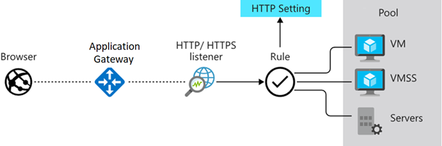

Processes traffic to webapps where the webapps running on multiple webservers:
* load balancing
* Inspecting traffic and acting as web application firewall
* Encrypting traffic between user and app gateway
* Encrypting traffic between app gateway and application servers. 

App gateway receives traffic on a public, a private or both. (But is limited to max one of each).

App gateway can have one or more listeners which listen on a combination of protocol, port, host and ip address. 

Listeners route the traffic to backendpool according to the defined routing rules.

Routing rules binds a listener to the backend-pools. 

## Load balancing
The app gateway routes the traffic based on the hostnames and paths which makes the app gateway a iso/osi layer 7 
load-balancer.

## App service as backend pool
If you're using Azure App Service to host the back-end application, you don't need to install any certificates in
Application Gateway to connect to the back-end pool. All communications are automatically encrypted. Application Gateway trusts the servers because Azure manages them.