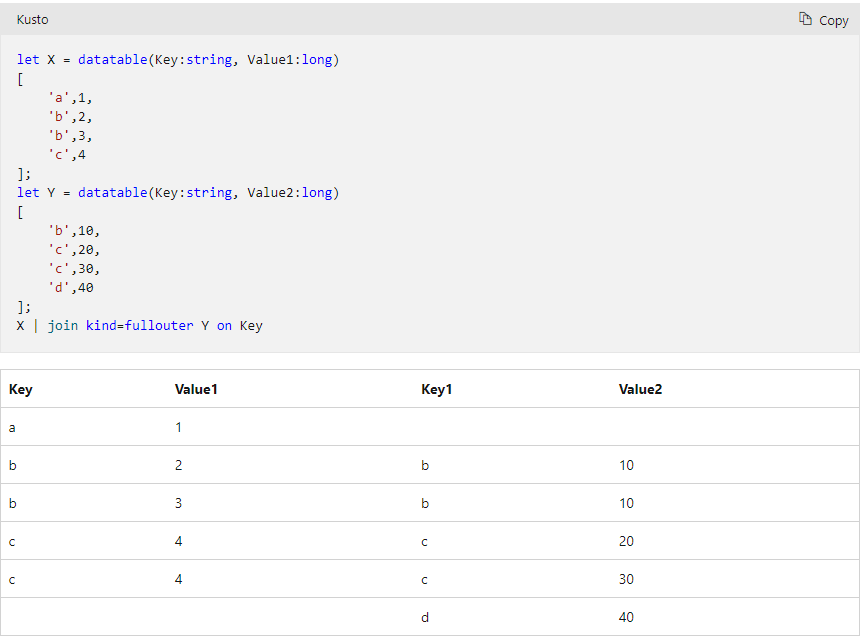

## Azure data logs Kusto syntax
I once had the problem that the request logs couldn't be retrieved because the url value contained characters which lead to malformed json (request where from vulnerability scan).
So I created a query which displays all columns expect the url one. Fortunately the url also appears in the name and operation_name column anyway.
```
let start=datetime("2021-09-09T05:11:00.000Z");
let end=datetime("2021-09-09T06:37:00.000Z");
requests
    | where timestamp > start and timestamp < end
    | where client_Type != "Browser"
    | project timestamp, id, source, name, success, resultCode, duration, performanceBucket, itemType, customDimensions, customMeasurements, operation_Name, operation_Id, operation_ParentId, operation_SyntheticSource, session_Id, user_Id,user_AuthenticatedId, user_AccountId, application_Version, client_Type, client_Model, client_OS, client_IP, client_City, client_StateOrProvince, client_CountryOrRegion, client_Browser, cloud_RoleName, cloud_RoleInstance, appId, appName, iKey,sdkVersion, itemId, itemCount
```

### Get all available logs for a specific string
```
union isfuzzy=true
availabilityResults,
requests,
exceptions,
pageViews,
traces,
customEvents,
dependencies
| where timestamp > datetime("2022-04-13T12:35:47.836Z") and timestamp < datetime("2022-04-15T12:35:47.836Z")
| where * has "AF9FC008-CAD5-E911-80CE-0050569BE8EF"
| order by timestamp desc
| take 1000
```

## Giving access Dashboards
Providing access to a specific dashboard is not enough. People also need to have reader access on the underlying data of the dashboard.
This can be achieved by providing the default role "Reader" for Azure Insights. 

### count

count all rows with same value
```| summarize meet_id_count = count() by meet_id```

Count distinct values of id grouped by user_id
```| summarize MeetingsCreatedAccount = dcount(meet_id) by user_Id```

### Failures
To separate different backend dependencies you can filter on "Dependency Base name". 

# Iff
```
dependencies
| where name contains "/zch_archivemetadata"
| extend docType_endpoint = iff(name contains "/metadata_a", "Type A", iff(name contains "/metadata_b", "Type B", "undefined"))
| summarize resultCodeCount = count() by resultCode, docType_endpoint
```

# fullouter join
If you want to join tables and want to keep data, even there is no match on the specified colum(s) you use fullouter-join
If there is no match, it will create a new key colum like in the following image for key "D": 



# make_set
Make_set comes in handy if you want to group values under one key in one row. 
```
let UserIdToUserName=(
customEvents
| where timestamp between(datetime("2020-01-01T00:00:00") .. end_time_report)
| extend customProperties = todynamic(tostring(parse_json(customDimensions['Properties'])))
| extend knownUser = tostring(parse_json(customProperties).username)
| where knownUser != "Unknown User"
| summarize username_corrected = make_set(knownUser) by user_Id
| project user_Id, tostring(username_corrected)
);
```

# mv-expand
Once you have a set or a list, you can do the reverse operation "mv-expand". This duplicates the row for each entry in the set and therefore flattens the set or list.

```
let UserIdToUserName=(
customEvents
| where timestamp between(datetime("2020-01-01T00:00:00") .. end_time_report)
| extend customProperties = todynamic(tostring(parse_json(customDimensions['Properties'])))
| extend knownUser = tostring(parse_json(customProperties).username)
| where knownUser != "Unknown User"
| extend normaizedUser = normalizeUserName(knownUser)
| summarize username_corrected = make_set(normaizedUser, 2) by user_Id
| mv-expand username_corrected
);
```

# summarize sum
You can use sum aggregation to aggregate values on multiple columns based on one or multiple keys (by clause)
```
UserIdToUserName
| join kind = fullouter (ActiveDaysCount) on user_Id
| join kind = fullouter (meetingCreatedCountContact) on user_Id
| summarize ActiveDays = sum(ActiveDays),
MeetingsCreatedContact = sum(MeetingsCreatedContact),
by tostring(username_corrected)
```

# function
You can create a function if you don't want to repeat yourself
```
let normalizeUserName = (userName:string) {
extract("^([^@]+)", 1, tolower(userName))
};

customEvents
| extend customProperties = todynamic(tostring(parse_json(customDimensions['Properties'])))
| extend knownUser = tostring(parse_json(customProperties).username)
| where knownUser != "Unknown User"
| extend normaizedUser = normalizeUserName(knownUser)

```