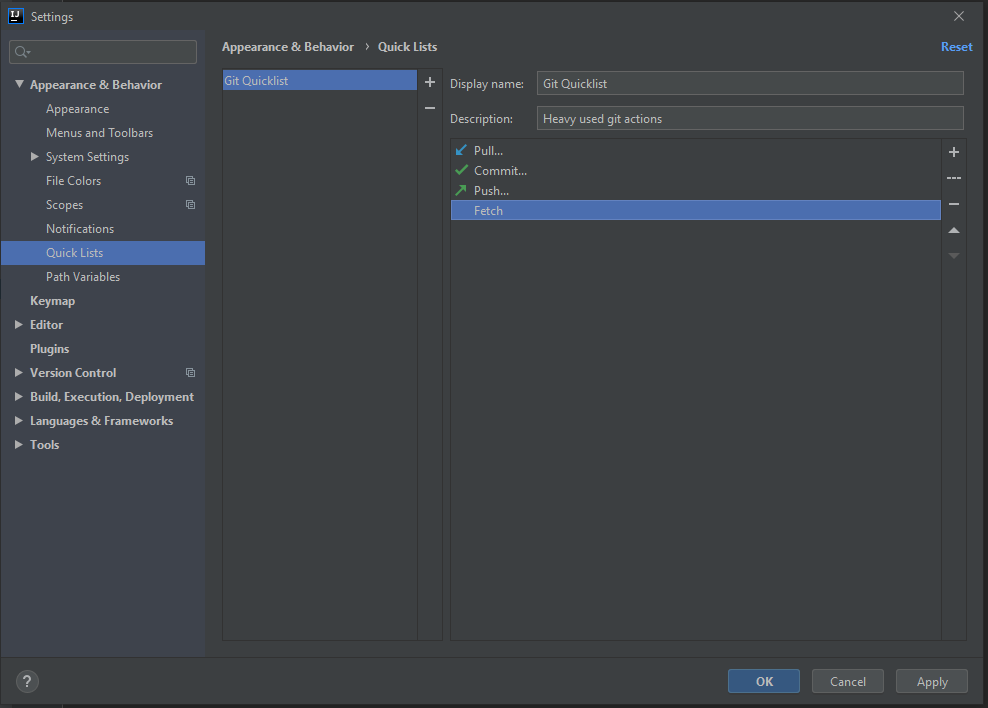

# Quicklists
To create a quicklist go to File -> settings -> Appearance & Behaviour -> Quick-Lists.
Here you can create a new Quicklist like: Git heavy used actions

Or you can just use the "VCS Operations" list. 

Now bind a shortcut to this quicklist via Keymaps. You will find your Quicklist there and 
can assign for example`Ctrl+$` to open this list.

# Shortcuts
Shift+F6 - Rename anything (file, method-name, variable-name, class-name) 

Ctrl+b - Go to implementation

Alt+F7 - Show usages

Ctrl+Alt+L - Auto format

## Search
Ctrl + Shift + s 