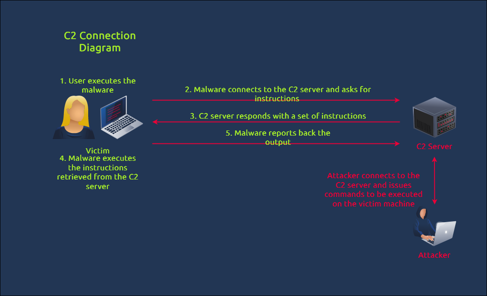

# Day9
Is about malware analysis

# Theory 

## .net binaries

.NET binaries are compiled files containing code written in languages compatible with the .NET framework, such as C#, VB.NET, F#, or managed C++. These binaries are executable files (with the .exe extension) or dynamic link libraries (DLLs with the .dll extension). They can also be assemblies that contain multiple types and resources.

Compared to other programming languages like C or C++, languages that use .NET, such as C#, don't directly translate the code into machine code after compilation. Instead, they use an intermediate language (IL), like a pseudocode, and translate it into native machine code during runtime via a Common Language Runtime (CLR) environment.

## C2
Command and Control (C2) Infrastructure are a set of programs used to communicate with a victim machine. This is comparable to a reverse shell, but is generally more advanced and often communicate via common network protocols, like HTTP, HTTPS and DNS. 

Seeing C2 traffic means that malware has already been executed inside the victim machine, as detailed in the diagram above. In terms of cyber kill chain stages, the attacker has successfully crafted and delivered the malware to the target and potentially moves laterally inside the network to achieve its objectives.

## Decompiling Malware Samples With dnSpy
dnSpy is an open-source .NET assembly (C#) debugger and editor.

# Challenge
Decompile an .exe malware and analyse whats its doing.

