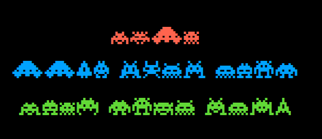
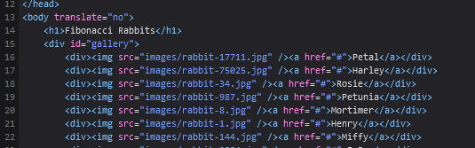
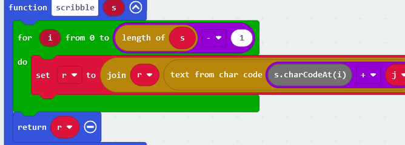

# 1 - Sp4c3 Inv4d3r5!


There was a .pdf to download with the solution written in strange font.
Just copy the text over notepad showed the solution. 

# 2 - Glitch
String needed to be read up-side-down
}ɥɔʇᴉしƃ_ǝしʇʇᴉし_ɐ_ʇ己几ɾ{ᄅᄅ０ᄅǝɥ

# 3 - I Key, You Key, ASCII
Shows some HEX representation of ASCII signs. 
Used ASCII table to translate into Chars.

# 4 - Alpha Bravo Charlie
Solution was writte in aviation alphabet. Every starting letter represents one letter in the solution. 

# 5 - Fibonacci Rabbits


There is a website with 27 images of rabbits. The images are name like rabbit-{fibonacci-number}.jpg. The first image 
got the name rabbit-1.jpg and the last one rabbit-514229.jpg  
After several deadends I opened excel to verify if the first 27 fibonacci numbers matches the images names and found 
out there was one missing number. Looking for this image (using the same pattern to fetch the image as the others) returned 
an image with the solution on it.

# 6 - Knäck låset
Knäck the cØde!

koda   ✅ 🔀 ❌   
2-9-7  1  0  2   
2-3-0  0  1  2   
7-8-2  0  2  1   
5-1-9  0  0  3   
5-9-8  0  1  2

I couldn't figure out what to do with it, so I googled the title and found out it is a well known riddle. Someone gives 
you some clues about the codes: 2-9-7 (1 number is correct, 0 numbers are correct but on wrong place, 2 numbers are wrong)
With this insights, its easy to get the right code.  

# 7 - City trip
An image showed some buildings. Solution is the name of the street where the picture was taken. 
I google reverse image searched the image and found the most significant building quite fast. 
It is somewhere in New York and most probably china town. Then I looked around on google maps and google streetview, 
tried some different angles to the significant building to match the angle on the downloaded image until I found it. 

# 8 - The Unicorn
No solution found so far
There is an image to download with a unicorn. image is named unicorn.png
The text on the riddle is: Ain't no CTF without a unicorn!

Steps I already did:
- google reverse image searched it and found it on a website to download if for free. 
- Tried different colors and filter on the image
- Opened the file in text editor, found RDF metadata about adobe, orientation of the image.
- Googled the rainbow flag. The colors are in the opposite order of the peace flag. In this order they are used as 
sign for lgbt community.
- dowloaded the other unicorn image and compared the content.

I uploaded the image to https://www.metadata2go.com/ and it printed no interesting metadata but this warning: 
```[minor] Trailer data after PNG IEND chunk```
Googling this warning got me this nice example: https://afnom.net/wtctf/2019/magic/

I searched for IEND String in the file content and saw that after IEND a complete second image 
(because its starts with x89PNG) is in the file.
I needed to figure out that windows doesn't like to have NUL values (x00) on the clipboard. 
To work with the file content on NotePad++ i needed to encode the content to Bas64 and copy paste it to another file 
and decode it again to utf8. Then I just deleted the first png and check what my imageviewer displays. The file
actually contained 6 images and the last one was the solution. 

# 9 - Bucket Egg
```My Irish friend told me about his new web site. He told me it was in a bucket named egg-in-a-bucket. No clue what that is...```

Hint is saying: ```Look into the cloud.```
First tried to access google buckets but it didn't lead to anything. After googling a bit more, I found out that amazon
also uses the name "bucket" to store information on their cloud. After several tries and looking again at the riddle it 
got clear that I need to search for a website and hosting location ireleland with the name "egg-in-a-bucket". This lead to: 
http://egg-in-a-bucket.s3-website-eu-west-1.amazonaws.com/

# 10 - Fire Alert
This website had a button on it which links to youtube. 
After studying the javascript on the website it came clear that it prints stuff to the console before forwarding the 
user to youtube. All I had to do is to set a breakpoint on jumping to youtube and check the console. Tada

# 11 - Copy Protection Pioneers
Riddle image showed a tape with imprint: Jet Set Willy
Googled it: Its a very old game which had a special copy protection card shipped with it (A matrix of 4 different colors). When you start the game
you needed to have this additional card at hand to press the right button when the game asked you on startup. 
Eventually someone just published this card and with this I could also provide the correct colors.

# 12 -  Statues
```Hope you like statues as much as I do!

I created a little tour in my favourite city for you:

    Richard I
    Peter Pan
    Albert
    James Cook

I will not reveal my favourite statue, though. Find it yourself!
```

Googled all the statues and figured out they are all in london. Then I created waypoints on google maps for every of 
these statues and trial and error all the statues close on the route. Tada, first try

# 13 - Snoopy
```IKIANJKDPKKAPJIDNKKAPNBHELCBHMGGDLOBLIPCKNAHFOEEBNFHALLBOMPGKJADFKDAGMNGIIGCDPEFBINCIPNFIMKGPPLFOMLGOKFAAIECBPJFM

</Password>
<Domain type="NT">CORP</Domain>
</Credentials>
<ClientName>THUMPERSDESK7</ClientName>
<ClientType>ica30</ClientType>
<ClientAddress>10.1
```

Looks like a part of xml request. Googled ica30 and found similiar xml structures for a protocol used in citrix. 
On this protocol it says the password is ctx1 encoded. So I searched for a tool to decode ctx1 into ascii or utf8, but 
it says wrong length of input. After several failed attempts I tried to truncate the input on the beginning, because I 
know anyway the first letters (he2022), and tada it printed me the solution without the first two letter. 
https://theorypc.ca/2014/11/28/exploring-the-citrix-xml-6-5-broker-in-more-detail/
https://gchq.github.io/CyberChef/#recipe=Citrix_CTX1_Decode()&input=S0lBTkpLRFBLS0FQSklETktLQVBOQkhFTENCSE1HR0RMT0JMSVBDS05BSEZPRUVCTkZIQUxMQk9NUEdLSkFERktEQUdNTkdJSUdDRFBFRkJJTkNJUE5GSU1LR1BQTEZPTUxHT0tGQUFJRUNCUEpGTQ
https://www.reddit.com/r/AskNetsec/comments/1s3r6y/citrix_ctx1_hash_decoding/


# 14 - LEDs


there is a hex dump file to download. Googled the Second line of the file and found a similiar hexdump used on: 
https://www.hackster.io/AbhijayS/micro-bit-snake-game-86c95d

So i tried to load the hex file into https://makecode.microbit.org/ and it suprisingly worked. 
The code looks like doing a ceasar rotation on the "encrypted" solution. Because I know the first letter I checked on
the ascii table that I need to rotate 14 times and tada. 

# 15 - Rabbits With Hats
A friend fled from its evil owner. I guess I am a rabbit now?
Clues: 
* "rabbits with hats"
* the number of words is important
* search the nearby area
* first letter is j, last one is y

3 words.
I am looking for a place.  

-> I tried https://what3words.com/rabbits.with.hats and then looked around on google maps. In the north of the location 
there is an interesting area, tada

# 16 - Crypto Bunny
Png to download: crypto_bunny.png
Text says: ```View my verified achievement from (HOP)².```

## (HOP)^2 as key?
(HOP) in decimal = (72 79 80)
^2 = 207’061’401’600


## PNG with embedded data
Editing the image with NP++ showed its a badged issued here: https://eu.badgr.com/public/badges/LaGEPKu1R2W5mg221vdV4g
```
Hash: 
  "recipient": {
    "hashed": true,
    "type": "email",
    "identity": "sha256$821158dcab489c45156fd110707bd2ec51d4365b1f34ed42ddde612383717338",
    "salt": "9529d9c5e91b4475a52b46fbe37cb55d"
  },
```

To optain the badge, the site tells us this: U2FsdGVkX1/G2uIf1R3WmIzrCnm3Hz6UQ9Dmm94/0/TtatYB5MDZZRgn/tjzQs5uzuxxPutLznGQlXOTMlcWjg==
Looks like a Base64 encoded string (Because of the == at the end. )

Badge Json:
```
{
  "type": "BadgeClass",
  "id": "https://api.eu.badgr.io/public/badges/LaGEPKu1R2W5mg221vdV4g",
  "@context": "https://w3id.org/openbadges/v2",
  "name": "Crypto Bunny",
  "image": {
    "id": "https://api.eu.badgr.io/public/badges/LaGEPKu1R2W5mg221vdV4g/image"
  },
  "description": "Crypto Bunny Award, for the rabbit cipher masters only.",
  "issuer": "https://api.eu.badgr.io/public/issuers/AF9rpdBhTMmCCh-Nj5WmKg",
  "tags": [
    "carrot"
  ],
  "criteria": {
    "narrative": "U2FsdGVkX1/G2uIf1R3WmIzrCnm3Hz6UQ9Dmm94/0/TtatYB5MDZZRgn/tjzQs5uzuxxPutLznGQlXOTMlcWjg=="
  }
}
```

## OpenSSL
Base64 decoded it looks like this:

```
        ÆÚâÕ֘
Salted__ƚ⟕֘Œ늹· >”CЦ›޿Ӵ�䀙e'þسBήάq>닎q•s“2WŽ
```

Googling for "Salted__" tells me that openSSL uses "Salted__" prefix in their encrypted files. If you encrypt something 
with openssl you will get a string prefixed with "Salted__"

This didn't lead to anything

## Rabbit cipher
https://eu.badgr.com/public/badges/LaGEPKu1R2W5mg221vdV4g
The text on the badge also says: ```Crypto Bunny Award, for the rabbit cipher masters only.``` I googled for
rabbit cipher and there is actually this one: https://en.wikipedia.org/wiki/Rabbit_(cipher)
And an online tool to encrypt decrypt:
https://www.browserling.com/tools/rabbit-decrypt

I just try and error with the password "carrot", because I found it as well in the badge description. 

# 17 - Jupiter One
Text: ```Jupiter is hiding something. Can you find it?```

Tipp: LSB

Googling for "LSB image" gave me this: https://medium.com/swlh/lsb-image-steganography-using-python-2bbbee2c69a2
Instead of writing my own python script, I just used this online service: https://stylesuxx.github.io/steganography/ 
this gave me the hidden information.  

# 18 - Ghost in a Shell 3

First of all I connected with SSH to the provided server. 


in the ~ directory there where two files: flag.txt and flag.enc

```ls -l .``` showed that only root can read the flag.txt. I can only see the encrypted content of it.

```
7e71896b4320:~$ ls -l flag.txt
-r--------    1 root     root            32 Mar 13 18:22 flag.txt
```
The content is something like this: Salted__4FoP.(6n؛ZA̔}43ACgE6CI 'tˠ
But it changes over time...  

With the command ```top``` I found out a crond was running. 
Checking crond command gave me the info where to find the crontab definitions: /var/spool/cron/crontabs


There is one crontab job:
```
c1530bc4a2bb:/var/spool/cron/crontabs$ ls -a
.     ..    root
```

content of root crontab. It runscipher.sh every minute
```
c1530bc4a2bb:/var/spool/cron/crontabs$ cat root
* * * * * /opt/bannerkoder/cipher.sh > /dev/null 2>&1
# empty line needed!
```

Cipher.sh encrypts flag.txt with the datetime information at runtime. (But stores the key in /tmp/7367111C2875730D00686C13B98E7F36)
```
c1530bc4a2bb:/var/spool/cron/crontabs$ cat /opt/bannerkoder/cipher.sh
#!/bin/bash
date +%s | md5sum | base64 | head -c 32 > /tmp/7367111C2875730D00686C13B98E7F36
openssl enc -aes-256-cbc -e -in /home/pinky/flag.txt -out /home/pinky/flag.enc -kfile /tmp/7367111C2875730D00686C13B98E7F36c1530bc4a2bb:/var/spool/cron/crontabs$
```

So all I had to do is this within 1 minute (crontab runs every minute)
Read the content of /tmp/7367111C2875730D00686C13B98E7F36
```
cat /tmp/7367111C2875730D00686C13B98E7F36
```

decrypt the flag.enc
```
openssl enc -d -aes-256-cbc -in /home/pinky/flag.enc
```
OpenSSL will ask for the password. Paste the content of /tmp/7367111C2875730D00686C13B98E7F36. Tada. 

# 19 - Coney Island Hackers

eat,sleep,hack,repeat

Two reactions so far:

http://46.101.107.117:2202/?passphrase=,
comma found

http://46.101.107.117:2202/?passphrase=1&?passphrase=2
passphrase param found more than once

http://46.101.107.117:2202/?req.query.passphrase=eat,sleep,hack,repeat

Why coney island hacker?

There is a serie called: https://mrrobot.fandom.com/wiki/Fsociety which is about a hacker group
based in coney island. Its led by Mr. Robot

## backwards
repeat'hack'sleep'eat

## Try and error

eatsleephackrepeat
eat´sleep´hack´repeat
eat'sleep'hack'repeat
eat`sleep`hack`repeat
eat\,sleep\,hack\,repeat


## command injection
https://auth0.com/blog/preventing-command-injection-attacks-in-node-js-apps/

Didn't really work

## multiple query params
This call lead to "Danger, multiple passphrase params" : http://46.101.107.117:2202/?req.query.passphrase=a&passphrase=eatcommasleepcommahackcommarepeat

Looking at the X-Powered-By response header, we know "Express" is the used npm webserver. 

Googling after req.query and Express I came across this answer: https://stackoverflow.com/questions/29539122/req-query-only-detecting-a-single-parameter-from-url

Then I tried http://46.101.107.117:2202/?passphrase[d] which led to an error. 
By chance I tried 46.101.107.117:2202/?passphrase[0]=eat,sleep,hack,repeat


# 20 - Textbook
It looks like the cipher is RSA encryption: 

encrypted = (message ^ e) % N

N = q*p (In this case q and p are primenumbers of 512 bytes)
e = 65537

The program does it for every letter. 
We only know e, the message (prefix "he2022") and the encrypted message. 
We don't know N, p, q

Do decrypt the message directly we should calculate the variable "d"

Found this one: https://medium.com/asecuritysite-when-bob-met-alice/cracking-rsa-a-challenge-generator-2b64c4edb3e7

But the very first problem is to get N. 
This forum says how that goes: https://www.mersenneforum.org/showthread.php?t=13524
m = encrpted message
c = plaintext


This is also an interesting site to read through later: https://ctf-wiki.mahaloz.re/crypto/asymmetric/rsa/rsa_chosen_plain_cipher/

Because x ^ e = c mod n
So n | x ^ e - c

Hardore crypto shit: https://blog.cryptohack.org/cryptoctf2020

#21 H₂O

Just some H₂O ...

33333336333032303332333333373230333233333330323033323330333032303333333633303230333233333337323033323331333432303332333133323230333433303230333633363230333733303230333433303230333633363230333633353230333433303230333633363230333633323230333433303230333633333230333633303230333433303230333633333230333633323230333433303230333633363230333633323230333433303230333633373230333133343332323033343330323033363336323033373330323033343330323033363331323033363337323033363331323033343330323033363336323033363334323033343330323033363337323033363332323033343330323033363336323033363330323033343330323033363336323033363337323033343330323033363333323033363333323033343330323033363331323033363335323033363336323033343330323033363335323033313334333632303334333032303336333632303331333433353230333433303230333633313230333633333230333633373230333433303230333633333230333633303230333433303230333633373230333733303230333433303230333633313230333633373230333633313230333433303230333633363230333633373230333433303230333633333230333633333230333433303230333633313230333633353230333633363230333433303230333633373230333133343334

Its 1100 chars long

Numbers from 0 - 7

histogramm: 
0 -> 123 times
1 -> 13 times
2 -> 99 times
3 -> 751 times
4 -> 32 times
5 -> 5 times
6 -> 63 times
7 -> 14 times

The 2 comes always as 32. 
The 7 always as 33373
The 1 comes always as 3331
The 5 comes always as 3335

he2022{


