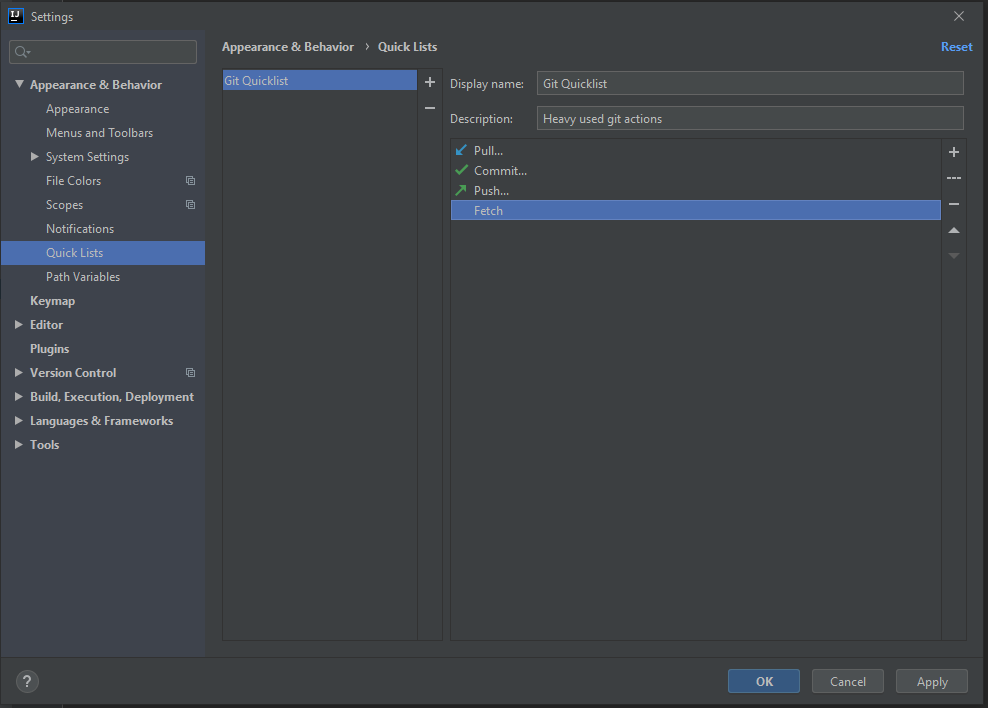

[Home](/)

# Quicklists
To create a quicklist go to File -> settings -> Appearance & Behaviour -> Quick-Lists.
Here you can create a new Quicklist like: Git heavy used actions

Now bind a shortcut to this quicklist. I use Ctrl+$ to open this list.

# Shortcuts
## Rename
Rename anything (file, method-name, variable-name, class-name) by pressing Shift+F6

## Go to implementation
Ctrl+b