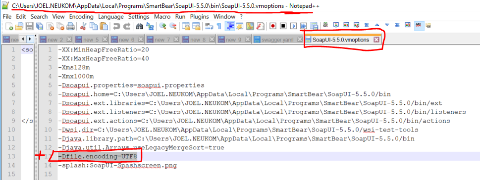
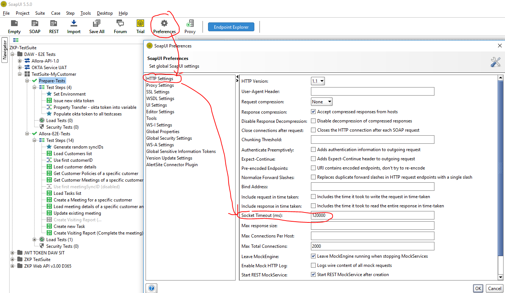

# Troubleshooting
## Import open api specification into SOAPUI
If you don't see the Project -> Import swagger menu:
The soapui-swagger-plugin-2.2-dist.jar is somehow not bundled. 
Download it from: [github](https://github.com/SmartBear/soapui/tree/release-5.6.0/soapui-installer/src/BundlePlugins)
And put it into C:\Users\%UserName%\.soapuios\plugins

## You might need to set character encoding to utf-8
[set encoding in vmoptions](https://stackoverflow.com/questions/35747109/where-do-i-set-character-encoding-in-soapui-preferences#:~:text=To%20set%20up%20an%20encoding,or%20iso%2D8859%2D1.)

## SocketTimeOut
If your requests run into SocketTimeouts you need to increase the threshold to an appropriate value (In milliseconds).  
 