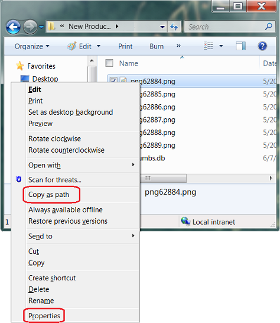

# Paths
To get the absolute path of a file you need to shift-right click on a file and click on getPath:



# PowerShell
To show manual you need to run Get-Help cmdlet: ```Get-Help Get-Credentials```

# BAT / CMD

## CMD
```
@echo off

set /p username= "Enter username: "
set /p password= "Enter password: "
curl --location --request POST "https://okta.com/oauth2/v1/token" ^
--header "Content-Type: application/x-www-form-urlencoded" ^
--header "flowid: PROD-getOktaToken-byAgent" ^
--data-urlencode "username=%username%" ^
--data-urlencode "password=%password%" ^
--data-urlencode "scope=openid" ^
--data-urlencode "grant_type=password"

pause

```